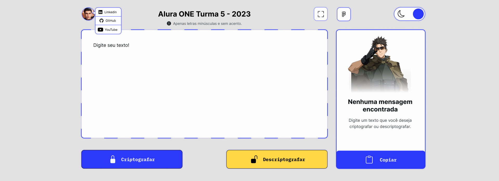
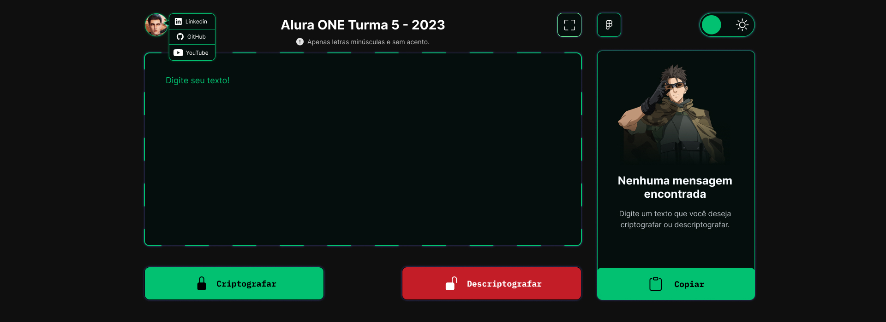
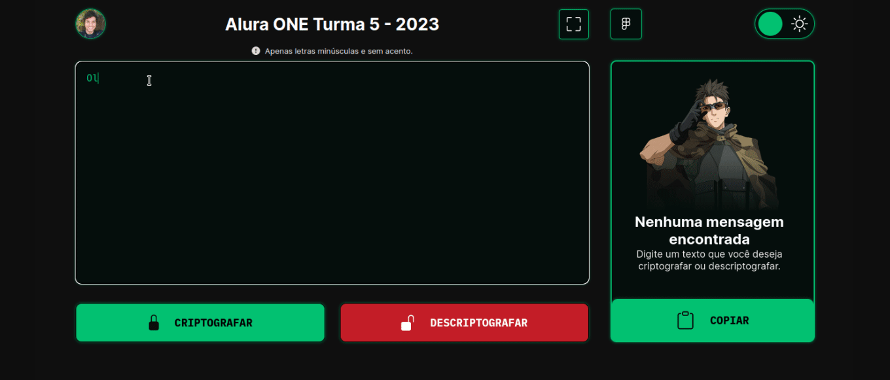
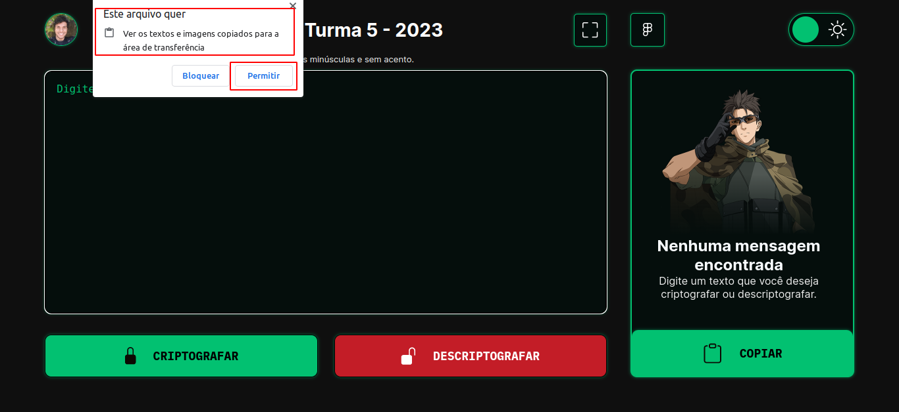

<h1 align="center">Challenge ONE Sprint 01 - Turma 5</h1>

<div align="center" style="display: flex; align-items: center; justify-content: center;">
    
    
</div>

<p align="center">
  <a href="#-sobre-o-desafio">Sobre o desafio</a>&nbsp;&nbsp;&nbsp;|&nbsp;&nbsp;&nbsp;
  <a href="#-design-do-decodificador-proposto-pelo-challenge">Design</a>&nbsp;&nbsp;&nbsp;|&nbsp;&nbsp;&nbsp;
  <a href="#-design-feito-por-mim-no-figma">Meu Design</a>&nbsp;&nbsp;&nbsp;|&nbsp;&nbsp;&nbsp;
  <a href="#-tecnologias">Tecnologias</a>&nbsp;&nbsp;&nbsp;|&nbsp;&nbsp;&nbsp;
  <a href="#-metodologias">Métodologias</a>&nbsp;&nbsp;&nbsp;|&nbsp;&nbsp;&nbsp;
  <a href="#-referencias">Referências</a>
</p>

<p>
    O objetivo desse Challenge era desenvolver um decodificador de texto em Javascript, onde pudesse criptografar um texto e depois descriptografar para o texto original.
</p>

## Sobre o desafio
### Descrição

> Durante estas duas semanas, vamos trabalhar em uma aplicação que criptografa textos, assim você poderá trocar mensagens secretas com outras pessoas que saibam o segredo da criptografia utilizada.

> As "chaves" de criptografia que utilizaremos são:

> - A letra "e" é convertida para "enter"
> - A letra "i" é convertida para "imes"
> - A letra "a" é convertida para "ai"
> - A letra "o" é convertida para "ober"
> - A letra "u" é convertida para "ufat"

### Requisitos:
> - Deve funcionar apenas com letras minúsculas
> - Não devem ser utilizados letras com acentos nem caracteres especiais
> - Deve ser possível converter uma palavra para a versão criptografada e também retornar uma palavra criptografada para a versão original.

> Por exemplo:
```Js
    "gato" => "gaitober"
    "gaitober" => "gato"
```

> - A página deve ter campos para inserção do texto a ser criptografado ou descriptografado, e a pessoa usuária deve poder escolher entre as duas opções
> - O resultado deve ser exibido na tela.

## 🔖 Design do Decodificador proposto pelo Challenge
<p align="center" >
    
</p>
<p>
    Foi dito que não era obrigatorio seguir o mesmo design, e que poderia fazer alterações, então visto isso, e como eu gosto de design também e já tinha visto alguns vídeos ensinando como mexer figma e  também um pouco sobre o conceito de design em si, e até como criar landing pages, resolvi criar um design do zero no figma já que essa seria a ocasião perfeita para práticar sobre o que eu aprendi com esses vídeos do YouTube.
</p>

## 🔖 Design feito por mim no Figma
Você pode visualizar o layout do projeto que eu fiz através [DESSE LINK](https://www.figma.com/community/file/1232402882150231621). É necessário ter conta no [Figma](https://figma.com) para acessá-lo.

### Tema Light
<p align="center" >
    
</p>

### Tema Dark
<p align="center" >
    
</p>

### Código responsável por salvar o tema no browser
```JS
function toggleTheme() {
    html.classList.toggle("dark");

    if(checkbox.checked) {
        saveTheme("light");
        console.log("light")

    } else {
        saveTheme("dark");
        console.log("dark")

    }
}

function saveTheme(theme) {
    localStorage.setItem("theme", theme);
}

function initTheme() {
    const theme = localStorage.getItem("theme");

    if(theme == "light") {
        checkbox.checked = false;
        html.classList.remove("dark");
        
    } else {
        checkbox.checked = true;
        html.classList.add("dark");
    }
}
```

<h2 align="center">💻 Projeto finalizado</h2>

<p align="center">
  
</p>

<div align="center">
  <table>
    <legend>Tempo de criação do design</legend>
    <tr>
      <th>🚩 INICIADO</th>
      <th>✅ FINALIZADO</th>
      <th>⏱️ HORAS</th>
    </tr>
    <tr>
      <td>18/04/2023</td>
      <td>19/04/2023</td>
      <td>12 HORAS</td>
    </tr>
  </table>
</div>

<div align="center">
  <table>
    <legend>Tempo de implementação do Challenge</legend>
    <tr>
      <th>🚩 INICIADO</th>
      <th>✅ FINALIZADO</th>
      <th>⏱️ HORAS</th>
    </tr>
    <tr>
      <td>19/04/2023</td>
      <td>25/04/2023</td>
      <td>17:30 HORAS</td>
    </tr>
  </table>
</div>


### Prévia do projeto em funcionamento

🚀 [Acesse por esse link o projeto online](https://danieldemoura.github.io/Challenge-ONE-Sprint-01)

<p align="center" >
    
</p>

### 👨‍💻 Tecnologias

Esse projeto foi desenvolvido com as seguintes tecnologias:

- HTML e CSS
- JavaScript
- Figma

### Métodologias
Para a criação desse projeto foram aplicadas 3 métodologias

- **Mobile First**
    - Mobile First significa Primeiro Mobile, ou seja, Mobile First consiste em você desenvolver a sua página pensando no Mobile(smartphones), já que maior parte dos acessos hoje em dia vem deles, por isso se deve dar uma maior atenção de performace, usabilidade e experiência de usuário, não significa que você não vai fazer isso para os outros formatos de telas como o Desktop, mas o Mobile First significa isso, você vai fazer tudo que fazia para o Desktop, mas agora focado em fazer em primerio lugar pensando em Mobile, pra depois de feito pensar nos outros tamanhos de telas.
- **BEM**
    - BEM é uma métodologia usada para a nomeação de classes CSS, facilitando a reutilização de códigos CSS e a escalabilidade do projeto, BEM é uma sigla para **Block Element Modifier** que significa: Bloco Elemento Modificador.
    - **Bloco** é componente idependente e que tem o seu próprio significado, exemplo: main, header, footer
    - **Elemento** é um elemento de um bloco, ou seja, ele depende do seu bloco, e fora do bloco ele não tem nenhum significado, resumindo um elemento é um filho de um elemento pai, no nome da classe um elemento é escrito dom dois underline(__). Nesse caso, a tag h1 é o elemento porque ele é filho da tag header, e o header séria o bloco. 
    ```Html
        <header class="header"> <!-- Bloco -->
            <h1 class="header__title">Título</h1> <!-- Elemento -->
        </header>
    ```
    - **Modificador** é escrito utilizando dois hífens(--) e ele é utilizado para modificar a aparência ou estado de um bloco ou elemento, o --text-red é o modificador, então a classe .header__title--text-red está definindo que o títlulo do header vai ter a cor vermelha.
    ```Html
        <header class="header"> <!-- Bloco -->
            <h1 class="header__title--text-red">Título</h1> <!-- Elemento -->
        </header>
     ```
    - **Por que utilizar dois underlines e dois hífens?** Você pode estar achando isso desnecessário, que só bastaria um hífen ou underline, mas pense um pouco, o BEM é uma convenção de nomes, que é conhecida no mundo todo, o que faz com que um Desenvolvedor saiba que um projeto está utilizando BEM é por causa dos dois hífens e underline.
    ```Html
        <!-- Usando o "BEM" sem os dois hífens e underline -->
        <header class="header"> 
            <h1 class="header_title-text-red">Título</h1> 
        </header>

        <!-- Usando de fato a métodologia BEM -->
        <header class="header"> 
            <h1 class="header__title--text-red">Título</h1> 
        </header>
        <!-- 
            Me diga qual desses 2 fica claro que está utilizando o BEM, sem falar
            que sem os __ e -- fica díficil saber o que é um elemento e um modificador. 
        -->
    ```

- **NAMESPACE**
    - É outra métodologia e que também pode ser utilizada em conjunto com o BEM, NAMESPACE é uma métodologia que consistem em utilizar préfixos, onde cada préfixos quer dizer alguma coia, exemplo o prefixo is- é utilizado para definir um estado, por isso pode trocar o --modificado do BEM por um is-, por dois motivos, primeiro porque a classe fica com um nome menor, e segundo se for utilizar o Javascript, o is- mais fácil de se entender o que está acontecendo ao adicionar aquela classe CSS.
    - Préfixo **js-** esse préfixo ele não  deve ser usando para estilizar um elemento, ele é exclusivo para o JavaScript, ou seja, se for pegar um elemento html, você deve utilizar a classe que tem o prefíxo js-. O motivo de se utilizar esse préfixo é bem simples, imagina que você está trabalhando em um projeto grande tem um botão com a classe button-encrypt, e você usa essa classe no JavaScript para pegar o elemento html, mas um dia por acaso você ou a sua equipe precisou trocar o nome da classe, nesse exato momento você vai ter que mudar o nome que está no JavaScript também, e as chances de você esquecer ou até escrever errado e causar um bug são grandes, mas uma vez utilizando o préfixo js- não importa se as outras classe tiverem o seu nome trocado, a classe que tem js- nunca vai mudar e assim, você não tem que se preocupar com todo esse trabalho que foi explicad antes.

### ⚠️ Problemas encontrados

1. No momento do desenvolvimento um dos maiores problemas foi o tamanho que o arquivo CSS ficou, mesmo utilizando o BEM para facilitar o entendimento das classes, no final o arquivo CSS por ter ficado muito grande foi um dos responsáveis pelo tempo gasto no desenvolvimento, gastou mais tempo para tentar achar uma classe no meio de várias outras.
2. Outro ponto foi a confusão que tive com as classes, já que essa foi a minha primeira vez que coloquei em prática o que estudei de BEM e NAMESPACE, por isso, tivesse dúvidas se estava fazendo certo, o que também foi outro responsável pela demora do desenvolvimento.
3. Na funcionalidade de colar o texto da área de tranferência ocorre um problema no firefox, onde não é possível colar, no Chrome é possível colar, mas antes é necessário permitr essa ação, mas mesmo permitindo, há casos que ainda assim, o texto não é colado automaticamente e é preciso recorrer ao atalho CRTL + V.
<p align="center" >
    
</p>

### 🛠️ Possível Solução
<p>
    Referente ao problema de arquivo CSS muito grande, uma possível solução seria a criação de uma pasta CSS onde dentro desta pasta teria todos os arquivos CSS, onde cada arquivo CSS seria o responsável por estilizar um componente da aplicação, então teria um arquivo para estilizar um botão, outro arquivo para estilizar imagem, e depois utilizando a regra import do CSS, no arquivo main.css seria importado todos esse estilos, e por fim no HTML faria um link para o main.css que tem a importação de todos os outros CSS.
</p>
<p>
    Se nota que será muitos arquivos CSS que terá que ser criado, mas o ponto positivo é que se for necessário estilizar apenas um componente eu posso ir diretamente no arquivo CSS específico do botão e modificar o estilo,e por ser um arquivo CSS de só um componente o código é pequeno e assim facilitando a manutenção.
</p>
<p>
    Por outro lado, como terá vários arquivos CSS é de suma importância saber nomear esses arquivos de forma que seja de fácil compressão, se não, terá dificuldade para achar o arquivo CSS em questão, e no final não terá resolvido o problema: evitar um amontoado de estilos CSS no mesmo arquivo e principalmente encontrar de forma fácil e rápida uma classe CSS específica.
</p>


## 📎 Referências
<p>
    Essas são todas as referências que consigo me lembrar que eu utilizei para desenvolver e resolver esse Challenge.
</p>

- Métodologias
    - Mobile First
        - Link: https://www.moblee.com.br/blog/mobile-first-principais-vantagens/

    - BEM 
        - Link: https://youtu.be/rltjnLyjFZk 
        - Link: https://youtu.be/STUy1I2qQjE
    - NAMESPACE
        - Link: https://youtu.be/24inN5LDO3M 

- Responsividade
    - Link: https://desenvolvimentoparaweb.com/css/css-breakpoints-maneira-correta/
    - Link: https://www.alura.com.br/artigos/guia-de-unidades-no-css

- Regex (Expressão Regular)
    - Link: https://pt.stackoverflow.com/questions/15738/como-validar-com-regex-uma-string-contendo-apenas-letras-espa%C3%A7os-em-branco-e-le
    - Link: https://developer.mozilla.org/en-US/docs/Web/JavaScript/Guide/Regular_expressions/Unicode_property_escapes
    - Link: https://developer.mozilla.org/en-US/docs/Web/JavaScript/Guide/Regular_expressions
    - Link: https://unicode.org/reports/tr18/#General_Category_Property

- Copiar para área de tranferência (Clipboard)
    - Link: https://www.youtube.com/watch?v=_qtaEkpnP68
    - Link: https://developer.mozilla.org/en-US/docs/Web/API/Clipboard

- Como deixar o site em tela cheia(FullScreen)
    - Link: https://www.w3schools.com/howto/howto_js_fullscreen.asp

---

<p align="center">
    Feito com ♥ by Daniel :wave: <a href="https://www.youtube.com/channel/UCHf8h4M94Wnw5o4deGWZKnw" target="_blank">Challenge ONE Sprint 01</a>
</p>
